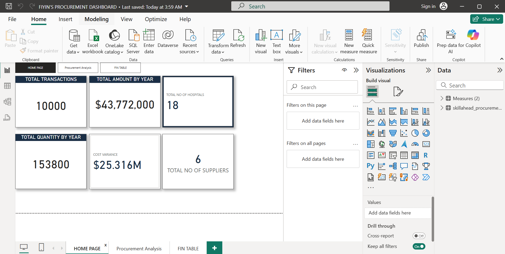
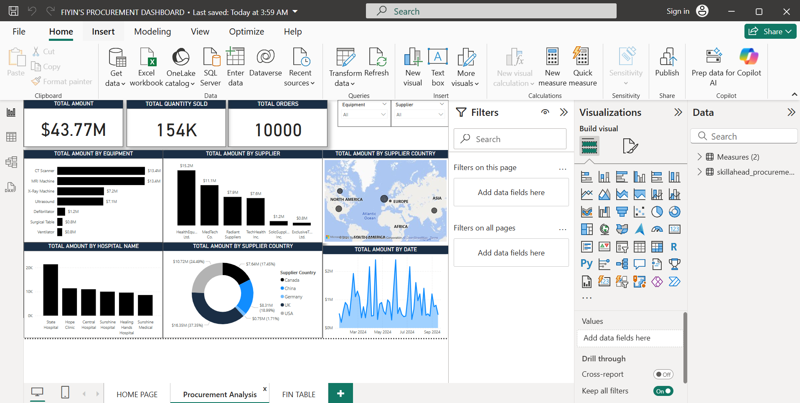
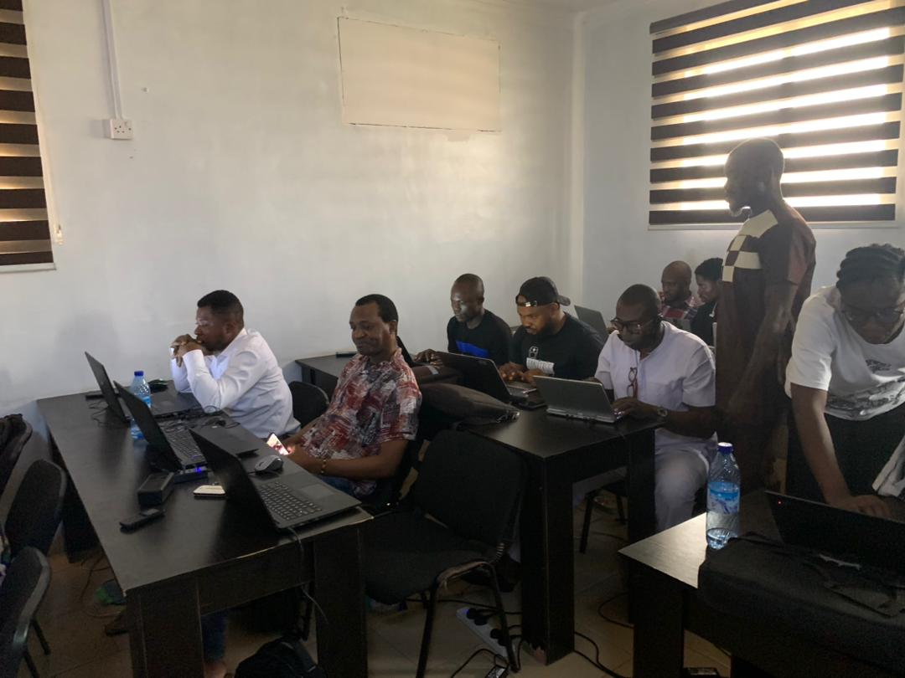
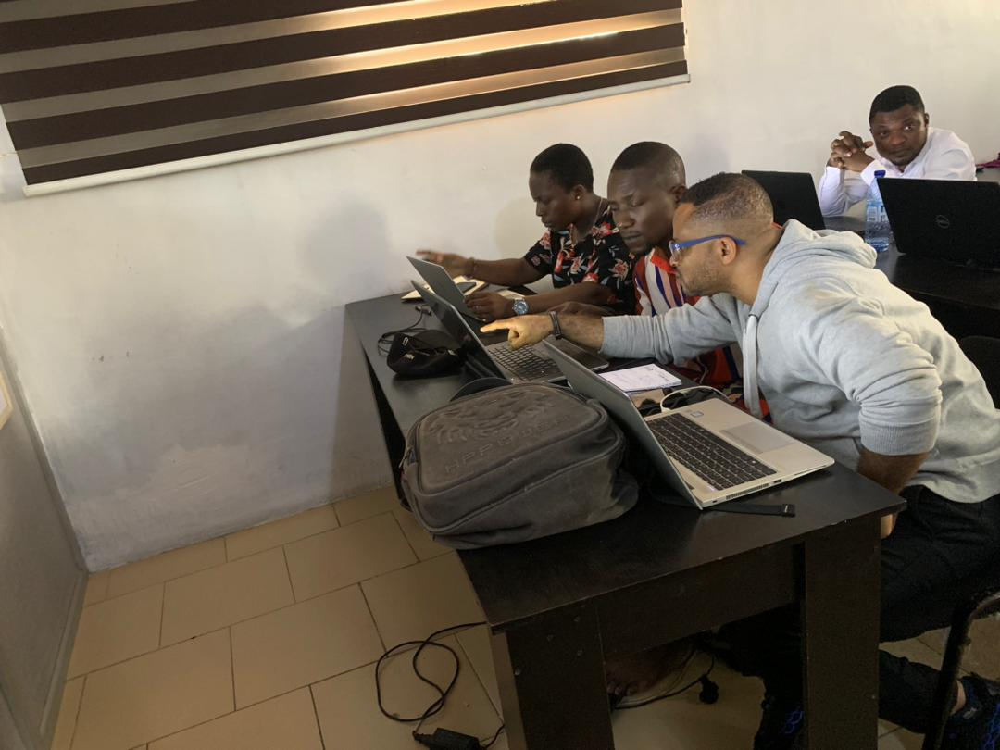
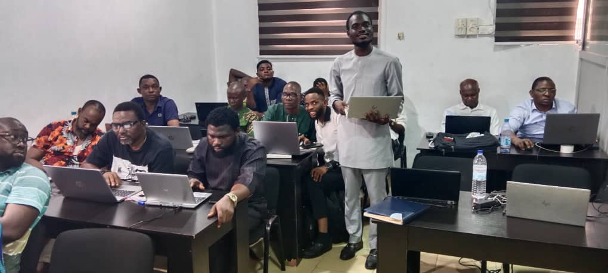

# BIO:
As a Business Intelligence Analyst, I specialize in transforming data into actionable insights that drive business decisions. With expertise in data analysis, reporting, and visualization, I leverage tools like Python, SQL, Power BI, and Microsoft Excel to identify trends, optimize processes, and support strategic initiatives. My goal is to empower organizations with data-driven solutions that enhance performance and achieve business objectives.
# SKILLS
1. Data analysis skills: Data cleaning and Transformation, Data modelling, Statistical analysis 
2. Technical skills: Scripting languages(Python and R), Query language(SQL:MYSQL,POSTGRES),data visualization
3. Communication skills; Data Storytelling, Reporting and Presentation(using tools like Canva, Powerpoint Power Bi AND Excel)
4. Domain Knowledge: I specialise in analysis of the following domain; Sales, Procurement, Performance, Healthcare.
5. Staff Training & Development(Educator): I offer concise and comprehensive training programs in data analytics and visualization both pysically and online
   
# PROJECTS
* [This project is on sales, tools used for analysis is microsoft excel to find out more click on this link](https://github.com/FIYINT/SALES-PERFORMANCE)
* [This project is on procurement, View Project on Github](https://github.com/FIYINT/PROCUREMENT_ANALYSIS)
* 
* 

Data Skills Traning

[Educating the next generation of data analyst](https://drive.google.com/drive/folders/118ysSHEGshXiSBb8GO2qSOW6_gv4ODR7)

  

# CONTACT DETAILS
|[Email me](mailto:fiyinfadayini@gmail.com)
||[Connect on linkedIn](https://www.linkedin.com/in/titus-fadayini-1b75a2176/)
||Phone No: +234-7013231356

